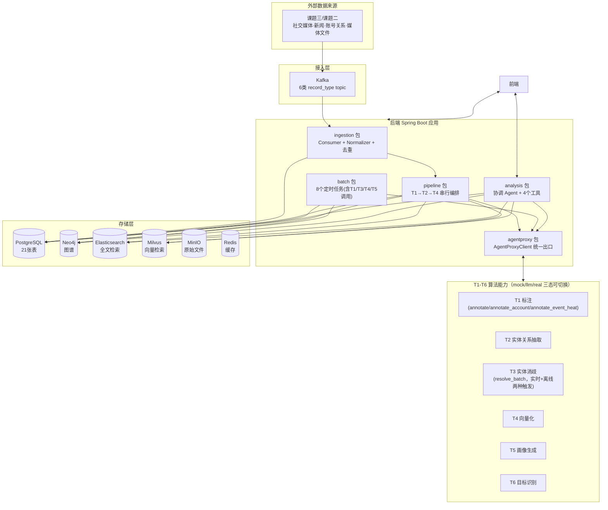

# 课题四 · 全息画像系统后端架构设计文档

> 版本：v1.0 · 2026-07-13
> 面向读者：T1-T6 各算法组
> 目的：说明后端总体架构、两条业务主线的运转方式，以及各位负责的算法能力在整个系统里所处的位置——即"我的接口输入从哪来、输出到哪去、谁在什么时候调用我"。
> 字段级接口规约、数据库表结构不在本文重复，见文末《十一、相关文档索引》。

---

## 一、系统是做什么的

系统接收课题二/课题三推送的社交媒体、新闻等原始数据，经过 T1（内容标注）→T2（实体关系抽取）→T3（实体归一）→T4（向量化）处理后写入多个存储，再由 T5（画像生成）、T6（目标识别）在此基础上做深度分析，最终服务于"高价值认知目标全息画像"这个目标：识别信息操控账号/团伙、还原叙事传播链路、生成人物画像。

后端是一个 **Spring Boot 单体应用**（不是微服务集群），内部按包划分模块，通过统一的 Agent 代理层调用 T1-T6 六个算法能力。

---

## 二、总体架构



**两条业务主线，职责完全不同，不要混为一谈：**

| | 入库线（Ingestion Line） | 分析线（Analysis Line） |
|---|---|---|
| 触发方式 | Kafka 消息到达，全自动 | 用户在前端发起查询/任务 |
| 参与的 T | T1（三个接口分别触发）、T2、T3（`resolve_batch` 实时判断+离线批量两条路径都会被入库线相关代码调用）、T4 | T5、T6（另有 T4 被入库线复用） |
| 处理节奏 | 逐条实时处理，秒级 | 按需触发，可能耗时数十秒 |
| 结果去向 | 写入 PG / Neo4j / ES / Milvus | 通过 SSE 实时推给前端 + 落库 |
| 代码位置 | `pipeline`、`ingestion`、`batch` 包 | `analysis` 包（协调 Agent） |

---

## 三、技术栈与部署

| 类别 | 选型 |
|---|---|
| 后端框架 | Spring Boot 3.5.13 + MyBatis-Plus |
| 关系数据库 | PostgreSQL（`172.16.40.232:5432`） |
| 图数据库 | Neo4j（Bolt协议，`bolt://172.16.40.232:7688`） |
| 全文检索 | Elasticsearch 8.12（`172.16.40.232:9200`） |
| 向量检索 | Milvus（`172.16.40.232:19530`） |
| 对象存储 | MinIO（图片/媒体文件原始存储） |
| 缓存 | Redis |
| 消息队列 | Kafka（`172.16.40.232:9092`，消费组 `cognitive-profile-ingestion`） |
| LLM 能力 | Spring AI + Qwen3-VL-32B-Thinking（协调 Agent 用于工具调用）、Qwen3-VL-Embedding-8B（T4 过渡期用于生成向量） |
| 部署方式 | 单容器 docker-compose，`5555:8080`，`/actuator/health` 健康检查 |

后端整体是**单体应用**，之前规划阶段讨论过拆分成多个微服务，实际落地时收敛为一个 Spring Boot 应用，内部通过包（package）做模块边界，部署和运维更简单。

---

## 四、入库线详解（数据接入过程）

这是算法组最需要理解的部分——你们的算法在这条流水线的哪一环被调用，输入是什么，输出会被怎么处理。

### 4.1 六种数据类型

课题二/三通过 Kafka 推送 6 类原始数据，每类一个 topic，独立的 Consumer + Normalizer 处理：

| record_type | 说明 | 处理方式 |
|---|---|---|
| `social_content` | 社交媒体帖子/评论/新闻正文 | 走完整 T1→T2→T4 流水线 |
| `social_account` | 账号资料 | 标准化 UPSERT `social_accounts` 后，同步调用 **T1.annotate_account** 做账号类型分类（见 `SocialAccountConsumer`），不是"只落库" |
| `account_relation` | 账号关系（关注/成员等） | 入库后异步回填UUID |
| `media_asset` | 图片/视频等媒体文件 | 入库后异步触发 T4 图像向量化 |
| `news_article` | 新闻报道 | 字段映射到 `media_contents`，走 T1→T2→T4 |
| `collection_task` | 采集任务元数据 | 仅落库，不触发算法处理 |

### 4.2 核心设计原则：先落原始记录，再标准化

所有数据无论哪种类型，第一步永远是**原始 JSON 整体写入 `raw_records` 表**（`raw_payload` 字段），之后才做字段映射、标准化写入业务表。这样做的原因：

- 支持失败重跑：T1-T4 任一环节失败，可以从 `raw_records` 重新发起，不用要求上游重推
- 支持证据溯源：画像结论最终都能追溯到某条 `raw_records`
- 字段格式变化时可以重新映射，不用等上游改造

`raw_records.pipeline_status` 状态机：`RECEIVED → NORMALIZED → T1_DONE → T2_DONE → T4_INDEXED`，失败则 `FAILED`。

### 4.3 数据分层（L0-L4）

| 层次 | 内容 | 存储 |
|---|---|---|
| L0 原始层 | 未经处理的原始 JSON | `raw_records` |
| L1 证据/标准化层 | 字段映射后的内容、账号、关系、媒体文件 | `media_contents`、`social_accounts`、`account_relations`、`media_assets` |
| L2 实体事实层 | T2/T3 产出的人物/组织/事件/叙事实体 | `persons`、`organizations`、`events`、`narratives`（PG）+ Neo4j 图谱 |
| L4 画像应用层 | T5 产出的人物全息画像（15 维度） | `person_profiles` |

（历史上讨论过 L3 关系知识层，目前关系统一落在 Neo4j，PG 侧不单独设 L3 表。）

### 4.4 T1→T2→T4 流水线执行顺序

`social_content` / `news_article` 类型数据的完整处理链路（代码见 `pipeline.PipelineExecutor`）：

```
Kafka 消息
  → Schema 校验 + payload_hash 去重
  → 写 raw_records（L0）
  → 标准化映射写 media_contents / UPSERT social_accounts（L1）
  → 创建 pipeline_task
  → T1AnnotationStep：调用 T1.annotate（不是 annotate_text，这是唯一一个内容标注action），
     写回 media_contents 的标注字段（AIGC检测 + 6个高价值主观维度 + 5个基础客观维度，
     详见 docs/T1_annotation_v0.6_README.md）
  → T2ExtractionStep：调用 T2.extract_entities 抽取mention和关系，
     紧接着**同步调用 EntityResolutionService**（内部会调 T3.resolve_batch）
     对本条内容抽到的mention做实时消歧，判断结果决定合并到已有实体还是新建，
     再把关系写 Neo4j（不经过PG中转）
  → T4IndexingStep：调用 T4.generate_text_embedding，向量写 Milvus，同时写 Elasticsearch 全文索引
  → pipeline_task.status = DONE
```

**关键点（这里之前的版本写错了，已更正）**：`PipelineExecutor` 编排的确只有 T1→T2→T4 三个显式 Step，但**这不代表 T3 只是一个独立的离线任务**。T3 的 `resolve_batch` 接口实际有两条调用路径：

1. **实时/准实时路径**：通过共享服务 `EntityResolutionService`，在 `T2ExtractionStep`（内容侧，每条内容处理时）和 `SocialAccountIdentityJob`（账号侧，每15分钟批次，判断账号 `displayName` 对应哪个 Person/Organization）里被调用，针对一小批新出现的mention做即时的合并/新建判断。
2. **离线全局融合路径**：`EntityDeduplicationJob`（每小时）独立调用，做更大范围的历史实体候选召回和批量重新校正。

两条路径调的是**同一个接口**（`docs/T3实体消歧接口规约.md` 里明确说过 T3 只有 `resolve_batch` 这一个接口，两种场景输入结构完全一样，T3 不需要区分调用方），差别只在"调用时机和候选集合大小"，不是两套不同的接口。详见下面 4.5 节。

任一 Step 抛异常，`RetryHandler` 负责标记 `pipeline_task` 对应步骤为 `failed` 并按指数退避重试；这层重试和 `AgentProxyClient` 的网络层重试（`@Retryable`，2次）是两层不同职责的重试，不要混淆。

### 4.5 T3 的实际定位：一个接口，两条调用路径

**路径一：实时/准实时判断**（`EntityResolutionService`，供内容侧和账号侧共用，避免各写一份）：

- 内容侧：`T2ExtractionStep` 抽取出mention后，立即调用，针对**这一条内容**里新出现的mention做判断
- 账号侧：`SocialAccountIdentityJob`（每15分钟）调用，针对**这一批账号**的 `displayName` 判断对应哪个已有 Person/Organization

判断结果三选一：`MERGE`（置信度≥0.9，自动合并到候选实体）、`REVIEW`（置信度≥0.6，写入 `entity_fusion_records` 待人工复核）、都不满足则 `CREATE`（新建实体，写 PG + Neo4j + 同步向量化写入 Milvus/ES）。这条路径的候选集合是后端**当场**用 ES+Milvus 检索出的一小批候选（`EntityCandidateRetrievalService`，Top10），不是全库扫描。

**路径二：离线全局融合**（`EntityDeduplicationJob`，每小时 `@Scheduled(fixedDelay = 3600000)`）：

1. 从 PG 按类型（人物/组织/事件/叙事）批量找出候选实体
2. 用 ES + Milvus 做候选召回（找出可能指向同一实体的多条历史记录，范围比路径一大得多）
3. 把候选集合打包调用 **T3.resolve_batch**（和路径一是同一个接口）
4. 高置信度（≥0.8）的合并建议自动执行，Neo4j 节点按 `stableUuid(type:canonicalName)` 幂等合并
5. 低置信度的合并建议写入人工复核队列，不自动执行

**给 T3 算法组的结论**：你们只需要实现 `resolve_batch` 这一个接口，输入结构（一个mention + 一批候选实体）不管来自哪条路径都完全一致，不需要感知调用方是谁、也不需要区分"实时"还是"离线"——这是后端调用方式的差异，不是你们接口层面要处理的事。

### 4.6 T4 的实际定位：纯向量化服务

这一点在项目早期和 RZDK 侧有过分歧，现在的实现是**后端把 T4 定位为纯粹的向量生成服务**：T4 只负责"给一段文本/一张图片生成向量"（`generate_text_embedding` / `generate_image_embedding`），不做检索。检索逻辑（混合检索：ES 全文 + Milvus 向量 + Neo4j 图谱关联）由后端自己的 `SearchService` 实现，在分析线里被 `searchContent` 工具调用。**T4 不需要、也不会被要求实现检索能力**，只要把向量算准就行。向量维度当前固定为 4096 维（Milvus Collection 建表时定死），T4 返回的向量维度必须与此一致，否则写入失败。

### 4.7 media_asset（图片等）单独的向量化路径

图片类媒体文件不经过 T1→T2→T4 主流水线，而是走 `ImageEmbeddingJob`（每10分钟跑一次）。这个任务实际做两件事：

1. **回填 T1 图片标注**：对那些当初入库时只有图片、没有正文文本、因而在主流水线里被跳过标注的内容，重新调用 **T1.annotate**（传图片，走同一个 `annotate` 接口，不是单独的图片接口）
2. **图像向量化**：调用 T4.generate_image_embedding，写入 Milvus

### 4.8 account_relation 的异步回填

账号关系数据入库时，`from_account_id`/`to_account_id` 往往还查不到对应的 `social_accounts.id`（可能账号数据还没到），所以先按平台原始用户ID存字符串，由 `AccountRelationBackfillJob`（每分钟跑一次）异步回填UUID外键；实在回填不上的成为"孤儿关系"，保留原始字符串不删除。

---

## 五、分析线详解（用户触发的深度分析）

分析线不是流水线，而是一个基于大模型 Function Calling 的**协调 Agent**（`CoordinatorAgentService`），用户在前端提出分析需求（比如"看看这个叙事背后有没有水军团伙"），协调 Agent 自主决定调用哪些工具、调用几次、以什么顺序调用，每一步都通过 SSE 实时推送过程给前端。

### 5.1 协调 Agent 可用的四个工具

| 工具 | 内部调用 | 对应的 T | 说明 |
|---|---|---|---|
| `searchContent` | `SearchService.searchHybrid` | 不调用T4，后端自建混合检索 | ES+Milvus+Neo4j 三路召回融合 |
| `identifyTargets` | `IdentificationTaskService` | **T6**.identify_targets | 输入账号列表或叙事ID，识别操控目标 |
| `queryGraph` | 直接查 Neo4j | 无 | 查实体间关联关系 |
| `generateProfile` | `GenerateProfileTool` | **T5**.complete_profile | 生成/补全人物全息画像 |

### 5.2 T6 调用前，后端要先替它把数据准备好

`IdentifyTargetsTool` 触发方式有两种（`triggerType`）：

- `narrative`：按叙事ID，后端先从 PG/Neo4j 查出该叙事下涉及的全部 `social_accounts[]` 和 `media_contents[]`
- `account_list`：直接给一批账号ID

**这一点算法组必须知道**：T6 不会自己去查数据库，输入的 `socialAccounts[]` 和 `mediaContents[]` 两个数组，是后端已经从 PG 组装好的完整数据，这两个数组就是 T6 做团伙识别/BEND手法分析的**全部数据来源**，字段不全会直接影响识别质量。

T6 的响应分三层：`account_identify_result`（账号级）、`entity_identify_result`（实体级）、`group_identify_result`（团伙级），后端分别写入 `identification_results` 表，其中 `targetType = "T00"` 的账号级结果**不落库**（T00 代表"未发现异常"，无需持久化）。

### 5.3 T5 画像生成的两种触发方式

- **定时批量**：`PersonProfileGenerationJob` 每天凌晨2点，按重要性排序，批量给待生成画像的人物调用 T5
- **用户即时触发**：分析线里 `generateProfile` 工具被协调 Agent 调用，针对单个目标即时生成

T5 需要自行连接 PG 和 Neo4j 查询该人物已有的账号、内容、关系数据（连接信息见接口规约文档），T5 返回的 15 个画像维度字段**必须全部非 null**——任何字段返回 null 都会清空该人物已有的画像数据，这是最容易踩的坑。

---

## 六、T1-T6 在架构中的角色速查表

| Agent | 一句话定位 | 谁调用、什么时候调用 | 输出写到哪 |
|---|---|---|---|
| **T1** | 标注，共**三个独立接口**：`annotate`(内容：AIGC检测+6主观维度+5客观维度)、`annotate_account`(账号类型分类)、`annotate_event_heat`(事件热度) | `annotate`：入库线每条内容 + `ImageEmbeddingJob`回填图片内容；`annotate_account`：账号入库时(`SocialAccountConsumer`)；`annotate_event_heat`：`EventHeatJob`每30分钟 | `media_contents`/`social_accounts`对应字段 + Neo4j |
| **T2** | 实体关系抽取 | 入库线，紧跟 T1 之后 | 直接写 Neo4j（不经PG中转），关系类型必须来自16类关系词表 |
| **T3** | 实体消歧判断，**只有一个接口** `resolve_batch`，但两条调用路径：①实时(内容侧`T2ExtractionStep`+账号侧`SocialAccountIdentityJob`每15分钟) ②离线全局融合(`EntityDeduplicationJob`每小时) | 见①② | 合并/新建 Neo4j 节点，低置信度进人工复核队列(`entity_fusion_records`) |
| **T4** | 纯向量生成（文本/图像） | 入库线（内容+图片）各自独立触发 | 向量写 Milvus，同时触发写 Elasticsearch |
| **T5** | 生成人物全息画像（15维度） | 每日定时批量 + 用户即时触发两种 | `person_profiles` 表 |
| **T6** | 识别操控目标（账号/实体/团伙） | 用户触发（按叙事或按账号列表） | `identification_results` 表 |

---

## 七、Agent 接入机制：三种运行模式

每个 T-Agent 在系统里实际有 **三种可切换的后端实现**，靠 `sub_agent_registry` 表的 `active_url_type` 字段控制，切换不需要改代码、不需要重启：

| 模式 | 说明 | 路由前缀 |
|---|---|---|
| `mock`（固定数据） | `MockAgentController` 返回预置的假数据，用于前端联调、不依赖任何真实算法 | `/mock/t{n}/...` |
| `mock`（LLM过渡） | `LlmAgentController` 用通用大模型（Qwen3-VL-32B-Thinking/Embedding-8B）现场生成一个"看起来合理"的结果，作为算法组正式接入前的过渡替身，**不是你们要交付的目标实现** | `/llm/t{n}/...` |
| `real`（算法组真实服务） | 指向算法组自己部署的服务地址（`base_url` 字段），这是最终目标 | 算法组自行提供 |

**所有调用必须经过 `AgentProxyClient`，全系统只有这一个出口**，请求地址拼接规则固定为：

```
完整请求 URL = base_url（或mock_url） + "/" + action
```

例如算法组部署后把 `base_url` 设为 `http://algo-t1:18001`，`action=annotate`，实际请求即 `POST http://algo-t1:18001/annotate`。T1 组要注意，`annotate`/`annotate_account`/`annotate_event_heat` 是三个不同的 action，理论上可以指向三个不同的服务地址，但 `sub_agent_registry` 当前是按 `agent_code`（即整个T1）一行配置一个 `base_url`，也就是说这三个 action 现在**共用同一个 base_url**，只是拼接的 action 路径不同——如果 T1 组打算把三个接口部署成三个独立服务，需要提前和后端沟通调整注册表结构。

调用约定：统一 `POST`，`Content-Type: application/json`，业务失败也返回 HTTP 200（通过响应体字段表达失败，不是用 4xx/5xx）。超时：T1/T2/T4/T6 默认 30 秒，T3/T5 默认 60 秒（可在 `sub_agent_registry.timeout_seconds` 单独调整）。T6 因为耗时较长且不适合部分重试造成状态不一致，**只调用一次，不做网络层自动重试**，其余 Agent 有 2 次重试。

**算法组接入自己的真实服务，只需要**：

1. 按对应的接口规约文档实现服务
2. 把 `sub_agent_registry.base_url` 更新为自己的服务地址
3. 把 `active_url_type` 改成 `real`
4. 通过 `PUT /api/system/agents/{code}/url-type` 或直接 UPDATE 表切换，前端也有对应的管理页面可以点击切换和做健康检查

---

## 八、定时批处理任务一览

除了入库线的实时流水线，后端还有 8 个后台定时任务，其中 4 个会调用 T-Agent（不只是 T3/T5，T1/T4 也有）：

| 任务 | 周期 | 作用 | 调用的T-Agent |
|---|---|---|---|
| `BatchImportJob` | 每1分钟 | 处理用户上传的批量导入文件 | 否 |
| `AccountRelationBackfillJob` | 每1分钟 | 回填账号关系的UUID外键 | 否 |
| `ContentPropagationBackfillJob` | 每10分钟 | 回填内容转发/引用关系到Neo4j | 否 |
| `ImageEmbeddingJob` | 每10分钟 | 回填图片内容的T1标注 + 图片向量化 | **T1**(annotate) + **T4**(generate_image_embedding) |
| `SocialAccountIdentityJob` | 每15分钟 | 账号实体身份识别（账号↔人物/组织关联，走`EntityResolutionService`） | **T3**(resolve_batch，实时路径) |
| `EventHeatJob` | 每30分钟 | 事件热度计算 | **T1**(annotate_event_heat) |
| `EntityDeduplicationJob` | 每1小时 | 实体归一去重（离线全局融合） | **T3**(resolve_batch，离线路径) + T4(候选召回用的向量检索) |
| `PersonProfileGenerationJob` | 每日凌晨2点 | 批量生成人物画像 | **T5**(complete_profile) |

---

## 九、存储层职责速查

| 存储 | 存什么 | 谁写、谁读 |
|---|---|---|
| **PostgreSQL** | 21张表，覆盖L0-L4全部业务数据、流水线任务状态、用户会话、Agent注册表 | 入库线全程读写；分析线读取 |
| **Neo4j** | 人物/组织/事件/叙事/账号/内容 节点 + 16类关系 | T2直接写；T3归一时更新；分析线`queryGraph`读 |
| **Elasticsearch** | 内容全文索引、实体全文索引、协调Agent意图解析日志 | T4步骤写；`searchContent`混合检索读 |
| **Milvus** | 文本向量、图像向量、实体语义向量（3个Collection，均4096维） | T4写；`searchContent`混合检索读 |
| **MinIO** | 图片/视频等原始媒体文件对象存储 | 入库时写；T4取图做向量化时读 |
| **Redis** | 缓存层 | 各处按需使用 |

数据库详细表结构、字段级定义见《课题四_数据库设计_v3.md》，不在本文重复。

---

## 十、算法组自查清单

接入真实服务前，建议对照检查：

- [ ] 我的 action 名称是否和接口规约文档一致（T1三个：`annotate`/`annotate_account`/`annotate_event_heat`；其余：`extract_entities`、`resolve_batch`、`generate_text_embedding`/`generate_image_embedding`、`complete_profile`、`identify_targets`）
- [ ] T1 组确认：三个 action 是否都实现了，不是只实现了 `annotate` 就以为完事（`annotate_account`在账号入库时会被实时调用，`annotate_event_heat`每30分钟被批量调用，两个都是生产链路会真实触发的，不是预留接口）
- [ ] T3 组确认：`resolve_batch` 只有一个接口，但会在完全不同的两种场景下被调用（内容侧实时/账号侧15分钟批次/离线每小时全局融合），三种场景传入的候选数量、调用频率差异很大，压测时要覆盖这几种量级
- [ ] 请求/响应字段名是否和对应的《Tn接口规约.md》逐字段核对过，尤其是嵌套结构
- [ ] T2 输出的关系类型是否严格取自《关系词表与头尾实体类型说明.md》16类，没有自造关系名
- [ ] T4 输出向量维度是否为 4096 维
- [ ] T5 是否15个字段全部返回非null（哪怕某维度暂时没有把握，也要给一个带低置信度的估计值，不能给null）
- [ ] T5 是否已具备自行连接 PG/Neo4j 查询目标人物已有数据的能力
- [ ] T6 是否正确处理了 `socialAccounts[]`/`mediaContents[]` 两个数组作为全部输入，而不是只用叙事元数据
- [ ] T6 返回结构是否严格按 `account_identify_result`/`entity_identify_result`/`group_identify_result` 三层
- [ ] 部署完成后，是否已把 `sub_agent_registry` 对应行的 `base_url`/`active_url_type` 更新为 `real`

---

## 十一、相关文档索引

| 文档 | 内容 |
|---|---|
| `docs/课题四_数据处理流程_v2.md` | 六种数据类型的详细逐步处理流程、失败重试、数据追溯方法 |
| `docs/课题四_数据库设计_v3.md` | PG 21张表字段级设计、ES/Milvus索引设计、Neo4j图谱设计 |
| `docs/T1标注接口规约 v1.md` | T1 三个接口（annotate/annotate_account/annotate_event_heat）的调用层规约（URL、请求体） |
| `docs/T1_annotation_v0.6_README.md` | T1 标注字段字典（**当前最新版**，含每个维度的判断标准和枚举值）——注意《T1标注接口规约 v1.md》正文里还写着引用 v0.5，是文档没同步，字段释义以 v0.6 为准，发现类似不一致建议直接反馈让仓库里的文档互相同步 |
| `docs/T2抽取接口规约.md` | T2 请求/响应字段级规约 |
| `docs/T3实体消歧接口规约.md` | T3 请求/响应字段级规约 |
| `docs/Kg融合接口规约 v1.md` | 知识图谱融合相关接口规约 |
| `docs/关系词表与头尾实体类型说明.md` | 16类关系类型权威定义，与代码不一致时以此为准 |
| `docs/01-CODEGEN-CONTEXT.md` | 全部21张表字段速查表 |

> 本文档与上述文档如有出入，以代码仓库当前实现为准；发现不一致请提出，及时同步更新。